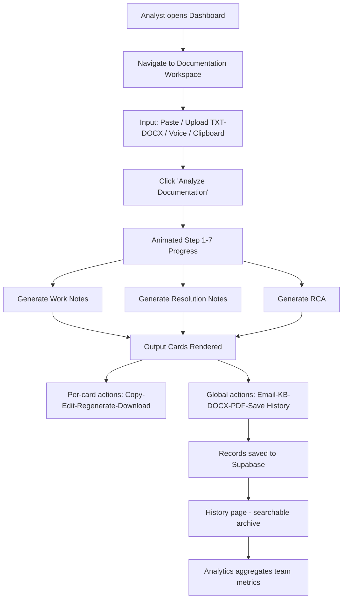

## 1. Product Overview

DXC AI Service Desk Documentation Assistant is an enterprise-grade internal web application for DXC Service Desk Analysts to convert customer conversations (Microsoft Teams chats, call transcripts, ticket summaries, troubleshooting notes, emails) into professional ITSM documentation using AI. The product transforms unstructured conversation data into standardized Work Notes, Resolution Notes, and Root Cause Analysis, dramatically reducing documentation time and improving consistency across ServiceNow incidents.

- **Target Users**: DXC Service Desk Analysts, L1/L2 Support Agents, Incident Managers
- **Core Problem**: Agents spend 20-40% of their time writing documentation after resolving incidents; quality and consistency vary widely
- **Market Value**: 50-70% reduction in documentation time; standardized ITSM output; improved audit compliance; faster knowledge base article creation

## 2. Core Features

### 2.1 User Roles

| Role | Registration Method | Core Permissions |
|------|---------------------|------------------|
| Service Desk Analyst | SSO / Supabase Auth Email | Analyze conversations, generate documentation, view own history, export |
| Team Lead / Manager | SSO / Supabase Auth Email | All analyst permissions + view team analytics, review history |

### 2.2 Feature Module

1. **Dashboard**: Hero section, quick stats (Today's Docs, Time Saved, AI Accuracy), recent activity
2. **Documentation Workspace**: Large input area for transcripts, toolbar actions (upload/paste/voice/clear), AI generation with step-by-step progress animation, three output cards (Work Notes, Resolution Notes, RCA)
3. **History Page**: Searchable, filterable list of all generated analyses; full detail view
4. **Templates Page**: Pre-built templates for common incident types (Outlook, VPN, Password Reset, etc.)
5. **Knowledge Base**: Generated KB articles index, search, view
6. **Analytics Page**: Team/individual documentation metrics, time saved, trend charts
7. **Settings Page**: Theme preference, AI model selection, export defaults, user profile

### 2.3 Page Details

| Page Name | Module Name | Feature description |
|-----------|-------------|---------------------|
| Dashboard | Hero Section | Large heading, subtitle, quick stat cards, recent activity feed |
| Dashboard | Navigation Header | Sticky glass-blur header; DXC logo + subtitle; nav links (Dashboard, History, Templates, KB, Analytics, Settings); theme toggle; user profile; AI Ready status |
| Documentation Workspace | Input Card | ~350px textarea; title "Chat Transcript / Call Summary"; description; toolbar: Upload TXT, Upload DOCX, Paste Clipboard, Voice Input, Clear, Analyze (primary gradient button) |
| Documentation Workspace | Generation Progress | Animated 7-step progress indicator with state messages (Reading → Understanding → Extracting → Work Notes → Resolution → RCA → Complete) |
| Documentation Workspace | Work Notes Card | Structured sections: Issue, TS Performed (bullets), Output, Next Action; actions: Copy, Edit, Regenerate, Download |
| Documentation Workspace | Resolution Notes Card | 2-3 sentence ServiceNow-ready paragraph; actions: Copy, Edit, Regenerate, Download |
| Documentation Workspace | RCA Card | Structured sections: Root Cause, Impact, Corrective Action, Preventive Action; actions: Copy, Edit, Regenerate, Download |
| Documentation Workspace | Global Actions Bar | Generate Customer Email, Generate KB Article, Export DOCX, Export PDF, Save to History |
| History | Search/Filter List | Date, time, tags, priority, app, agent filters; card/list view toggle |
| History | Detail View | Full transcript + all three outputs with edit capability |
| Templates | Template Library | Categorized templates with preview and apply-to-workspace |
| Knowledge Base | Article Index | AI-generated articles, searchable, category tags, export option |
| Analytics | Metrics Dashboard | Bar/line charts: docs per day, time saved trend, accuracy rate, top incident types |
| Settings | Preferences | Light/Dark/System theme, default export format, AI prompt tuning |

## 3. Core Process

The analyst lands on the Dashboard → navigates to Documentation Workspace → pastes or uploads conversation transcript → clicks "Analyze Documentation" → AI runs 7-step generation pipeline with animated progress → Work Notes / Resolution Notes / RCA cards render simultaneously → Analyst copies/edits/regenerates individual outputs or uses global actions (export DOCX/PDF, save to history, generate email/KB article) → Saved records appear in the History page with full searchability → Over time, Analytics aggregates productivity metrics.

## 4. User Interface Design

### 4.1 Design Style
- **Design Language**: Official DXC enterprise aesthetic — inspired by DXC.com, Microsoft Copilot, ServiceNow, Linear, Vercel Dashboard
- **Light Theme Background**: Warm beige/cream `#FBF8F3` (not pure white, matched to DXC banner reference image), cards `#FFFFFF` with 18-20px rounded corners, subtle drop shadows, soft gray borders
- **Dark Theme Background**: Deep navy `#0A1224`, cards `#131E36`, secondary cards `#1B2946`, text `#FFFFFF`, secondary text `#C8D0E0` — no neon, GitHub Dark + Copilot feel
- **Accent Gradient**: DXC signature Blue → Orange → Purple gradient (buttons, highlights, logo accents, progress bars)
- **Typography**: Inter font family; large spacious headings (32-48px for hero); comfortable line-height (1.5-1.6); readable body sizes (14-16px)
- **Button Style**: Primary = full DXC gradient bg, rounded-xl, subtle shadow, hover scale+shadow lift; Secondary = light bg with gray border, hover fill tint
- **Icon Style**: Lucide React outline icons, 18-20px stroke, consistent weight, subtle gradient-tinted on active
- **Layout**: Top navigation with sticky blurred glass; desktop-first generous spacing (padding 24-32px, gaps 24-40px); card-based composition; asymmetric balanced grids on dashboard; two-column workspace (input left, outputs right on wide screens)
- **Decorative Touches**: Hero area has subtle DXC-style gradient mesh blur (orange → purple → blue) in background corner; soft noise/ grain texture on light theme; thin 1px borders with low opacity

### 4.2 Page Design Overview

| Page Name | Module Name | UI Elements |
|-----------|-------------|-------------|
| Dashboard | Navigation Header | Sticky, backdrop-blur, thin bottom border; logo left, nav links center, theme+profile+status right |
| Dashboard | Hero | 2-column asymmetric layout; huge gradient-heading + subtitle left; 2x2 stat cards + gradient mesh backdrop right; Framer Motion fade-in + slide-up stagger |
| Dashboard | Stats Cards | Large number + label, icon badge with gradient bg tint, subtle hover lift, rounded-2xl, soft shadow |
| Dashboard | Recent Activity | Vertical timeline of last 5 actions, agent avatar, doc title, relative timestamp, tag chips |
| Documentation Workspace | Page Layout | Top header + body split: Input card (1 col) above or left; Output cards (3-col grid) below or right |
| Documentation Workspace | Input Card | Large rounded-2xl card; beige/white fill; toolbar actions as icon-button chips with labels; textarea has focus ring with gradient accent; Analyze button prominent gradient |
| Documentation Workspace | Progress Stepper | Horizontal 7-step pipeline; animated checkmark/dot states; gradient progress bar fill; description text for each step; Framer Motion sequential reveal |
| Documentation Workspace | Output Cards | Three equal-height cards, rounded-2xl, soft shadow, header with gradient icon badge + title, divider line, structured sections with bold sub-headings, per-card action button row (Copy/Edit/Regenerate/Download as icon+tooltip) |
| Documentation Workspace | Global Actions | Pill-shaped button row below output cards; gradient primary, secondary outlines; Lucide icons left of label |
| History | Layout | Top search bar + filter chips (date range, priority, agent, app, tags); result cards in grid or list; each card shows title, date/time, tag chips, priority badge, preview text, view button |
| History | Detail View | Full-width modal or page; transcript in left column, three docs in right columns, save/edit buttons |
| Templates | Library Grid | Category tabs top; template cards with title, description, preview snippets, apply button |
| Knowledge Base | Index | Search bar, category sidebar, article list cards with AI-created date, category tags |
| Analytics | Dashboard | Metric hero cards (Total Docs, Time Saved hrs, Accuracy %, Avg Doc Quality); trend line chart (docs/day); bar chart (top incident types); heatmap calendar for docs per day |
| Settings | Layout | Left sidebar nav (Profile, Appearance, AI, Exports, About); right content panels; toggles and dropdowns with shadcn style |
| Global | Theme Toggle | 3-option segmented control: Sun/Moon/Monitor icons; Light/Dark/System labels; instant CSS-variable swap with Framer Motion color transition |
| Global | Animations | Page transitions fade+slide 300ms; card hover lift 4px + shadow deepened; button hover scale 1.02; loading pulses; progress steps animate sequentially |

### 4.3 Responsiveness
- **Desktop-first design** (1440px+ baseline). Generous spacing, multi-column grids.
- **1024px (Tablet Landscape)**: Dashboard stat cards condense to 2x2; Workspace becomes stacked (input top, outputs bottom in 2-col grid); nav links truncate to icon-only with tooltips.
- **768px (Tablet Portrait)**: All grids collapse to single column; nav becomes hamburger drawer; action toolbars wrap onto two rows; cards reduce border-radius slightly.
- **Touch optimization**: Minimum 44px tap targets for all interactive elements; no hover-only critical actions; swipe-left to delete/archive in History list.

### 4.4 3D Scene Guidance
Not applicable — this is a 2D enterprise data/forms application; depth will be conveyed through elevation (shadows, z-index stacking, backdrop-blur) rather than 3D scenes.
