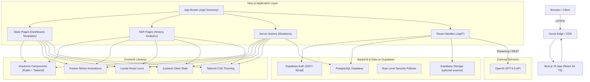
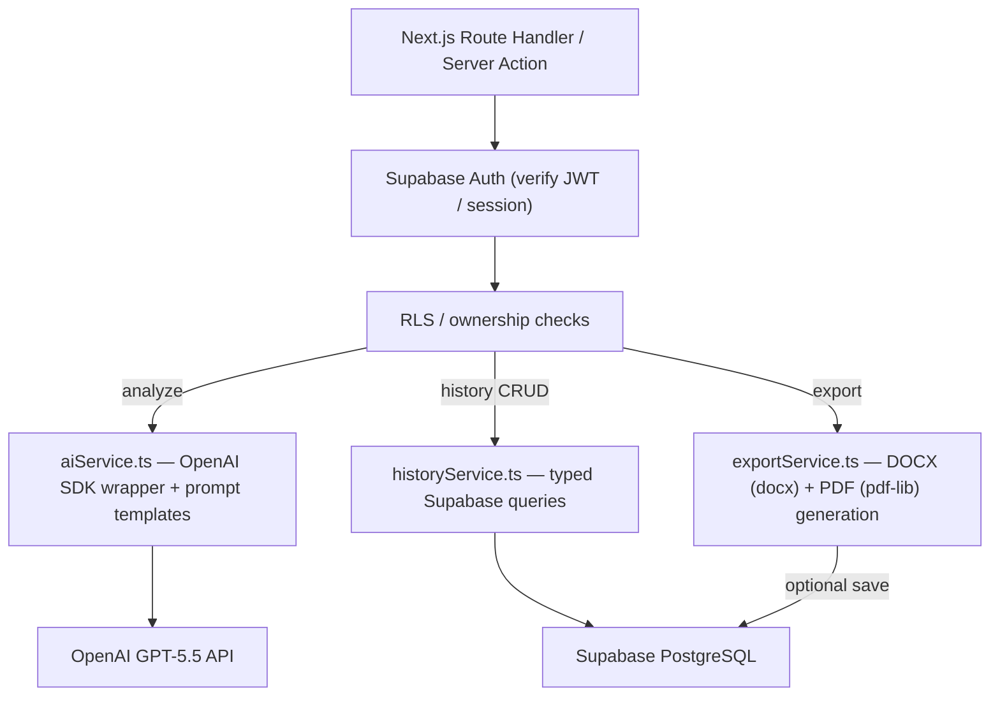
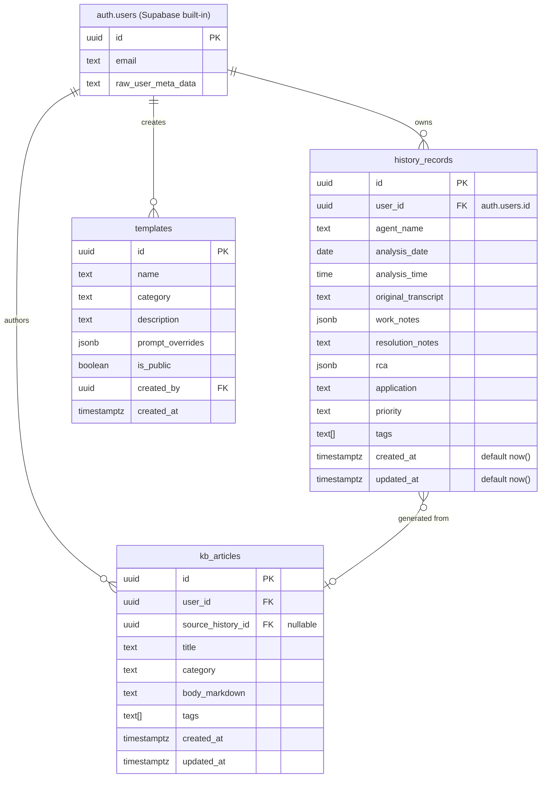

## 1. Architecture Design



## 2. Technology Description

- **Frontend Framework**: Next.js 15 with App Router (App/ directory), React 19, TypeScript strict mode
- **Styling**: Tailwind CSS v3 + CSS variables for theming (Light/Dark/System), custom DXC color palette
- **UI Component Library**: shadcn/ui (manually installed via CLI, Radix primitives), themed to DXC design language
- **Animations**: Framer Motion (page transitions, stepper progress, staggered card reveals, micro-interactions)
- **Icons**: Lucide React (outline style, consistent with enterprise clean look)
- **State Management**: Zustand for client-side UI state (theme, workspace inputs, generation state)
- **Initialization**: `npx create-next-app@latest . --typescript --tailwind --eslint --app --no-src-dir --import-alias "@/*"` followed by `npx shadcn@latest init`
- **Backend / Auth**: Supabase (Auth + PostgreSQL + RLS policies). Supabase client in browser + server actions
- **AI Provider**: OpenAI GPT-5.5 called from Next.js Route Handlers (server-side only, keys in `.env.local`)
- **Deployment**: Vercel via `vercel.json` config; environment variables set in Vercel project dashboard

## 3. Route Definitions

| Route | Purpose | Rendering |
|-------|---------|-----------|
| `/` | Dashboard landing — hero, quick stats, recent activity | Static + ISR partial |
| `/documentation` | Main workspace — input + AI outputs + actions | Client-side state + Server Actions |
| `/history` | Searchable list of saved analyses | SSR with search params |
| `/history/[id]` | Detail view of single analysis record | Dynamic SSR |
| `/templates` | Incident template library | Static |
| `/knowledge` | Generated KB articles index | SSR |
| `/analytics` | Team/individual productivity metrics | SSR + client charts |
| `/settings` | User preferences, theme, profile | Client state + Server actions |
| `/login` | Supabase Auth login page | Static |
| `/api/analyze` | Stream OpenAI GPT-5.5 generation (all 3 docs) | Route Handler (POST) |
| `/api/history` | CRUD for saved analysis records | Route Handler |
| `/api/export/docx` | Generate DOCX export of outputs | Route Handler |
| `/api/export/pdf` | Generate PDF export of outputs | Route Handler |
| `/api/email` | Generate customer email text via AI | Route Handler |
| `/api/kb` | Generate knowledge base article via AI | Route Handler |

## 4. API Definitions

```ts
// /api/analyze — Request body
export interface AnalyzeRequest {
  transcript: string;
  templateId?: string;
  agentName?: string;
  application?: string;
  priority?: "Critical" | "High" | "Medium" | "Low";
  tags?: string[];
}

// /api/analyze — Streaming SSE response events
export type AnalyzeProgressEvent =
  | { step: 1; message: "Reading conversation..." }
  | { step: 2; message: "Understanding issue..." }
  | { step: 3; message: "Extracting troubleshooting..." }
  | { step: 4; message: "Generating Work Notes..."; partial?: string }
  | { step: 5; message: "Generating Resolution..."; partial?: string }
  | { step: 6; message: "Generating Root Cause Analysis..."; partial?: string }
  | { step: 7; message: "Completed." };

export interface AnalyzeFinalResponse {
  workNotes: {
    issue: string;
    tsPerformed: string[];
    output: string;
    nextAction: string;
  };
  resolutionNotes: string;
  rca: {
    rootCause: string;
    impact: string;
    correctiveAction: string;
    preventiveAction: string;
  };
  summary: {
    title: string;
    estimatedTimeSavedMinutes: number;
    tags: string[];
    application: string;
    priority: AnalyzeRequest["priority"];
  };
}

// /api/history — Saved record shape
export interface HistoryRecord {
  id: string;                    // uuid
  userId: string;                // supabase auth uid
  agentName: string;
  date: string;                  // ISO date
  time: string;                  // "HH:mm:ss"
  originalTranscript: string;
  workNotes: AnalyzeFinalResponse["workNotes"];
  resolutionNotes: string;
  rca: AnalyzeFinalResponse["rca"];
  application: string;
  priority: AnalyzeRequest["priority"];
  tags: string[];
  createdAt: string;
}
```

## 5. Server Architecture Diagram

Server-side logic lives inside Next.js Route Handlers and Server Actions — no separate backend process.



## 6. Data Model

### 6.1 Data Model Definition



### 6.2 Data Definition Language

```sql
-- Enable extensions
create extension if not exists "pgcrypto";
create extension if not exists "uuid-ossp";

-- HISTORY RECORDS table
create table if not exists public.history_records (
  id uuid primary key default gen_random_uuid(),
  user_id uuid not null references auth.users(id) on delete cascade,
  agent_name text not null default '',
  analysis_date date not null default current_date,
  analysis_time time not null default current_time,
  original_transcript text not null default '',
  work_notes jsonb not null default '{}'::jsonb,
  resolution_notes text not null default '',
  rca jsonb not null default '{}'::jsonb,
  application text not null default '',
  priority text not null default 'Medium',
  tags text[] not null default '{}',
  created_at timestamptz not null default now(),
  updated_at timestamptz not null default now()
);

create index if not exists idx_history_user_created
  on public.history_records (user_id, created_at desc);
create index if not exists idx_history_tags
  on public.history_records using gin (tags);
create index if not exists idx_history_priority
  on public.history_records (priority);

-- RLS + permissions
alter table public.history_records enable row level security;

grant select, insert, update, delete on public.history_records to authenticated;

create policy "Users can CRUD their own history_records"
  on public.history_records
  for all
  to authenticated
  using (user_id = auth.uid())
  with check (user_id = auth.uid());

-- TEMPLATES table
create table if not exists public.templates (
  id uuid primary key default gen_random_uuid(),
  name text not null,
  category text not null default 'General',
  description text not null default '',
  prompt_overrides jsonb not null default '{}'::jsonb,
  is_public boolean not null default true,
  created_by uuid references auth.users(id) on delete set null,
  created_at timestamptz not null default now()
);

alter table public.templates enable row level security;
grant select on public.templates to anon, authenticated;
grant insert, update, delete on public.templates to authenticated;

create policy "Templates readable by all; writable by creator"
  on public.templates
  for all
  using (is_public = true or created_by = auth.uid())
  with check (created_by = auth.uid());

-- KB_ARTICLES table
create table if not exists public.kb_articles (
  id uuid primary key default gen_random_uuid(),
  user_id uuid not null references auth.users(id) on delete cascade,
  source_history_id uuid references public.history_records(id) on delete set null,
  title text not null,
  category text not null default 'General',
  body_markdown text not null default '',
  tags text[] not null default '{}',
  created_at timestamptz not null default now(),
  updated_at timestamptz not null default now()
);

create index if not exists idx_kb_user_created
  on public.kb_articles (user_id, created_at desc);

alter table public.kb_articles enable row level security;
grant select, insert, update, delete on public.kb_articles to authenticated;

create policy "Users can CRUD their own KB articles"
  on public.kb_articles
  for all
  to authenticated
  using (user_id = auth.uid())
  with check (user_id = auth.uid());

-- auto-updated_at trigger helper
create or replace function public.trigger_set_updated_at()
returns trigger language plpgsql as $$
begin
  new.updated_at := now();
  return new;
end; $$;

create trigger trg_history_updated_at
  before update on public.history_records
  for each row execute function public.trigger_set_updated_at();

create trigger trg_kb_updated_at
  before update on public.kb_articles
  for each row execute function public.trigger_set_updated_at();
```
